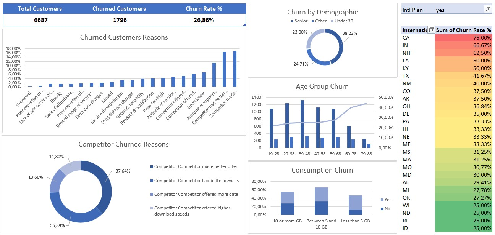

# Customer Churn Analysis | Excel Project

## **Overview**
This project explores customer churn patterns using Excel. The dataset contains customer information, churn labels, and possible reasons for churn. Through data cleaning, analysis, and visualization, this project uncovers key insights into churn drivers and customer behavior.

## **Dataset**
The dataset consists of customer details, churn status, reasons for churn, usage data, and plan types.

## **Exploratory Data Analysis**

### 1️⃣ **Data Preparation**
- Created two tables: **Aggregate** and **Customers** for better organization.
- Performed data cleaning by identifying and removing duplicate values using both **Remove Duplicates** and **Conditional Formatting**.

### 2️⃣ **Churn Calculation**
- Added a new column **"Churned"** in the Customers table using `IF()` to convert the **Churn Label** column into binary values:
  - **1** = "Yes" (Churned)
  - **0** = "No" (Retained)
- Created a **Pivot Table** to calculate:
  - **Total Customers**
  - **Churned Customers**
  - **Churn Rate (%)**

### 3️⃣ **Analyzing Churn Reasons**
- Created a **Pivot Table** to analyze churned customers by **Churn Reason** and calculated the percentage of total churn.
- Visualized the analysis with a **2D Bar Chart**.

#### **Competitor Churn Analysis**
- Identified that the highest churn percentage was due to competitors.
- Filtered churn reasons related to competitors and visualized the distribution.

### 4️⃣ **Investigating Churn Patterns**

#### **Churn by Demographics**
- Created an **"Age Group"** column using `IF()` to classify customers into:
  - **Under 30**
  - **Senior**
  - **Other**
- Used a **Pivot Table** to analyze churn rate by demographic groups.

#### **Churn by Age Group**
- Grouped customers by age brackets (e.g., 19-28, 29-38, etc.).
- Created a **line and clustered column chart** to visualize churn rates across age groups.

#### **Churn by Unlimited Plan Usage**
- Created a Pivot Table to analyze customers with an **unlimited data plan**.
- Found that unlimited plan users tend to churn more.
- Added a **"Data Usage"** category to group users into:
  - **Less than 5 GB**
  - **Between 5 and 10 GB**
  - **10 or more GB**
- Visualized churn rates by **stacked column chart**.

#### **Churn by International Call Plan**
- Created a **churn rate matrix by State and Intl Plan** using Pivot Tables.
- Applied **Red-Yellow-Green conditional formatting** to highlight high churn rate areas.

#### **Churn by Contract Length**
- Grouped customers by **contract duration** (in months).
- Analyzed how churn rates vary across different contract lengths.

## **Dashboard & KPIs**
The final dashboard includes:
- **Key Metrics**: Total Customers, Churned Customers, Churn Rate %
- **Competitor Churn Reasons**: Breakdown of churn reasons related to competitors
- **Demographics Analysis**: Churn rates by age and customer groups
- **Consumption Behavior**: Churn rates based on data usage
- **State & International Plan Impact**: Churn rates by region and plan type

 **Dashboard**:

## **Key Insights**
- The **highest churn reason** is due to **competitor offers**.
- **Older customers (50+)** have a higher churn rate.
- Customers on **unlimited plans** are more likely to churn.
- Certain states (e.g., **CA, IN, NH**) have **higher churn rates**, especially for customers on an **International Plan**.

## **Tools Used**
- Microsoft Excel (Pivot Tables, Charts, Conditional Formatting, Formulas)

---
